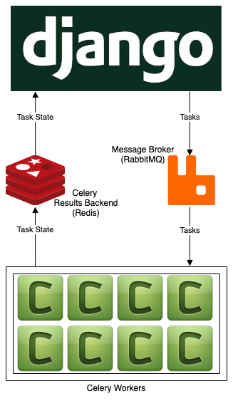

# Architecture



# Getting Started

1. Generate an API key at [api.nasa.gov](https://api.nasa.gov/) and add it to a `.env` file in the root directory.

2. Start RabbitMQ and Redis on Docker

```bash
docker run -d -p 5672:5672 rabbitmq
```

```bash
docker run -d -p 6379:6379 redis
```

3. From within this repo's root directory, run the following commands in order to install this project's dependencies in a [virtual environment](https://pipenv.pypa.io/en/latest/) and run a Django web server:

```bash
pip install --user pipenv
```

```bash
pipenv shell
```

```bash
pipenv install
```

```bash
python3 manage.py runserver
```

4. Open a second terminal window and run the following:

```bash
python3 -m celery -A demo_project worker -l info --concurrency=8
```
